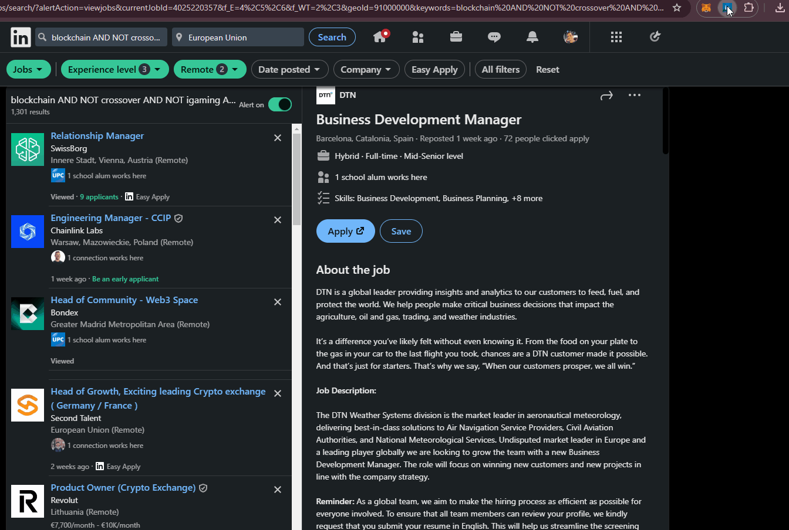

# LinkedIn Jobs Garbage Collector Extension

The extension checks to find a job post and renders it differently if it is not interesting.

Just clone the repo and follow the installation instructions here: https://developer.chrome.com/docs/extensions/get-started/tutorial/hello-world

## Features
💡 Ability to disable the extension 

🆗 Whitelist keywords

🛑🔤 Blacklist keywords. You can discard DevOps jobs, for instance

🛑🏭 Blacklist companies. Get rid of that company that ghosts you

💾 Remove the already applied, viewed or saved jobs

🔇 Remove the promoted ones too (it is amazing the amount of this kind)

✨ Ultra focus mode where you can not only set a transparent setting for the unwanted ones, you can make them disappear

⌚ Highlight jobs that are not crowded yet, you are connected to an employee or when the company reviews the applications early